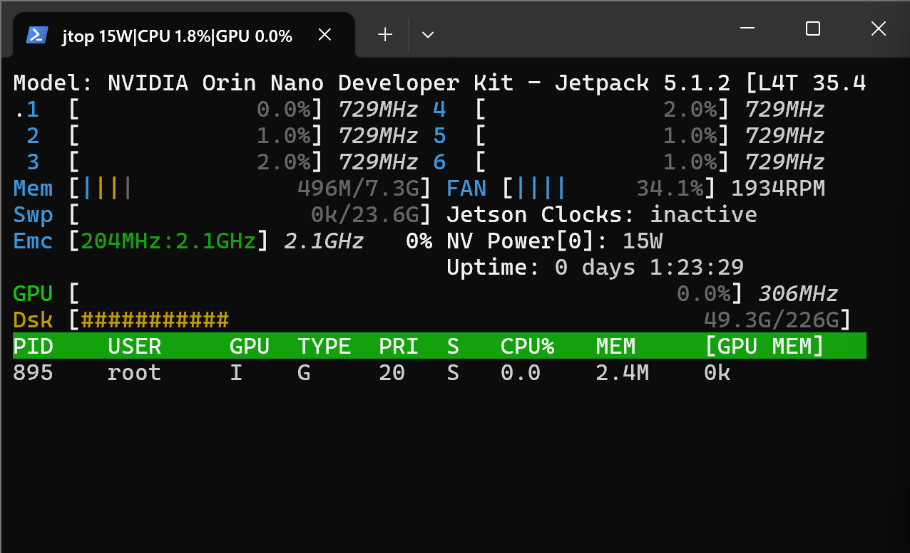

# NVIDIA Jetson GenAI Lab Tutorials on Orin Nano (8GB)

This tutorial provides examples of the models that can run and be made efficient on an Orin Nano kit(8GB).
This tutorial offers a straightforward introduction to Edge ML for beginners. It highlights essential prerequisites needed when using the Jetson Orin Nano (8GB) Developer Kit but lacks in-depth technical explanations. The tutorials are designed to be accessible, helping you get started without overwhelming technical details.

Lets start from the start:

To run a model on the jetson orin nano (8GB) developer kit, all you need to do is load the model with  oobabooga web-ui and run the model and boom you are a edge AI developer, right?? right?? well😂

<break>

> **_NOTE:_**  We may need to run some prerequisities before running the model on the Jetson Orin Nano (8GB) Developer Kit.

## Prerequisites:

1. Disable the GUI on the Jetson Orin Nano (8GB) Developer Kit.
    - The GUI consumes a lot of RAM and CPU, which is not recommended to run the models on the Jetson Orin Nano (8GB) Developer Kit.
    - To disable the GUI, run the following command:
    ```bash
    sudo systemctl set-default multi-user.target
    sudo reboot
    ```
    - To enable the GUI, run the following command:
    ```bash
    sudo systemctl set-default graphical.target
    sudo reboot
    ```

2. Use NVMe SSD for booting instead of conventional SD Card.
    - Conventionally, SD Cards can't be used efficiently to run the swap memory as the read and write speed of the SD Card is hell slower.
    - 512GB NVMe SSD (https://www.amazon.in/BlueTM-NVMeTM-Creative-Subscription-Warranty/dp/B09HKG6SDF)

3. Swap Memory of atleast 16GB.
    - Basically swap memory works as a virtual memory that is needed when the RAM runs out, If we try to run a model lets say Thebloke - 13b(13 billion parameters) requires 7.9 to 16GB of RAM to run the model. Which is impossible for the orin kit with 8GB of RAM.
    - To create a swap memory of 16GB, run the following commands:
    ```bash
    sudo systemctl disable nvzramconfig
    sudo fallocate -l 16G /ssd/16GB.swap
    sudo mkswap /ssd/16GB.swap
    sudo swapon /ssd/16GB.swap
    ```
    - Then add the following line to the end of /etc/fstab to make the change persistent:
    ```bash
    /ssd/16GB.swap  none  swap  sw 0  0
    ```
    - Now, you might wonder if SWAP memory will allow you to run any model on the Jetson Orin Nano (8GB) Developer Kit. The answer is no. While SWAP memory can assist in running models that require a significant amount of RAM on edge devices, there are still limitations to consider, which leads us to the next point.

4. Run quantized model only.
    - Quantization is a technique that reduces the size of the model and helps to run the model on  any hardware device in exchange of the accuracy(quality) of the model.
    - The models that are quantized are suffixed with the extension `.gguf` which means the model is quantized and can be run on less powerful hardware devices. Few other quantizations techniques you can look for are `.GPTQ`,`PTQ`, `AWQ`, `QAT`.
5. Use `Jtop` to monitor the CPU and RAM usage.
    - `Jtop` is a tool that helps to monitor the CPU and RAM usage on the Jetson Orin Nano (8GB) Developer Kit.
    - To install `Jtop`, run the following command:
    ```bash
    sudo pip3 install jetson-stats
    sudo systemctl restart jtop.service
    ```
    - To run `Jtop`, run the following command:
    ```bash
    jtop
    ```
<break>

## Hardware Used:

1. NVIDIA Jetson Orin Nano (8GB) Developer Kit
2. 512GB NVMe SSD (https://www.amazon.in/BlueTM-NVMeTM-Creative-Subscription-Warranty/dp/B09HKG6SDF)

## Models Tested:
✅ - good
❌ - bad
🤷‍♂️ - ok

| Model Name | Quantization | Memory | RAM Consumed | Works |
| :--------- | :----------: | :----: | :----------: | :---: |
| [`TheBloke/Llama-2-7b-Chat-GGUF`](https://huggingface.co/TheBloke/Llama-2-7B-Chat-GGUF) | llama-2-7b-chat.Q4_K_M.gguf | 5,268 | 4.0GB | ✅ |
| [`TheBloke/Llama-2-13b-Chat-GGUF`](https://huggingface.co/TheBloke/Llama-2-13B-chat-GGUF) | llama-2-13b-chat.Q2_K.gguf | 5,430 | 7.93 GB | 🤷‍♂️ |
