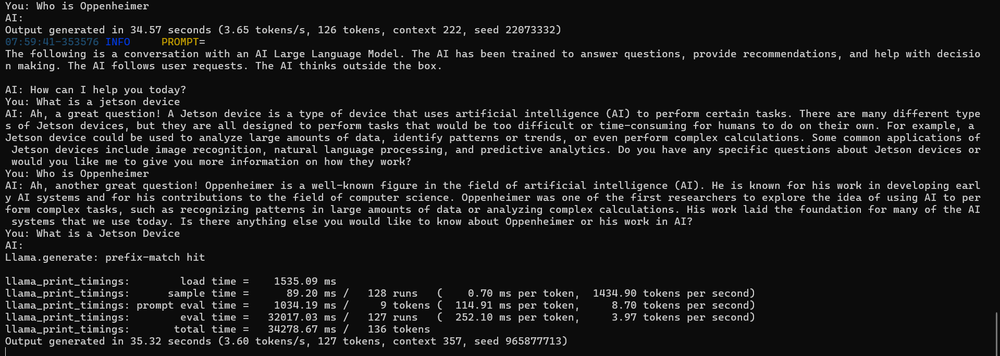
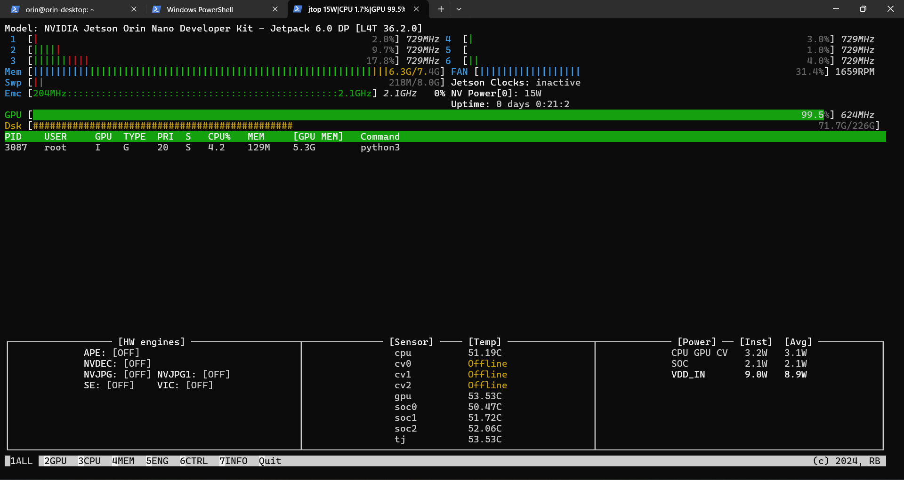

# Benchmarking results on TheBloke/LLAMA-2-7B-Q2_K_GGUF Model

We loaded the model from [`TheBloke/Llama-2-7b-Chat-GGUF`](https://huggingface.co/TheBloke/Llama-2-7B-Chat-GGUF) to check the inference speed and number of tokens per second. The benchmarking results are taken from **NVIDIA Jetson Orin Nano 8GB Developer kit**. The results are as follows.

**Note**: Before loading the model set the n-gpu-layers to 128 to get the accelerated inference.

# Model Parameters

| Parameter            | Value               | Description                                                                          |
|----------------------|---------------------|--------------------------------------------------------------------------------------|
| Model Name           | llama-2-7B    | Identifier for the LLAMA-2-7B GGUF model.                                              |
| Quantization format         | GGUF        | Quantization format used on the model.                               |
| Parameters           | 7 billion           | Number of parameters in the model.                                                      |
| Model Size                 | 5,268   | Size of the model |

## Inference Timing Results on Jetson Orin Nano 8GB Developer Kit

| Task             | Timing           | Description                                                                        |
|------------------|------------------|------------------------------------------------------------------------------------|
| Load time        | 1535.09 ms       | Time to load or initialize components                                               |
| Sample time      | 89.20 ms / 128 runs | Time to sample data (0.70 ms per token, 1434.90 tokens/s)                         |
| Prompt eval time | 1034.19 ms / 9 tokens | Time to evaluate prompts (114.91 ms per token, 8.70 tokens/s)                    |
| Eval time        | 32017.03 ms / 127 runs | Time for evaluations (252.10 ms per token, 3.97 tokens/s)                         |
| Total time       | 34278.67 ms / 136 tokens | Total time for the task execution (3.60 tokens/second)                                                  |

## Benchmarking Images

Model Benchmarking Results

<break>

Jtop Results

<break>